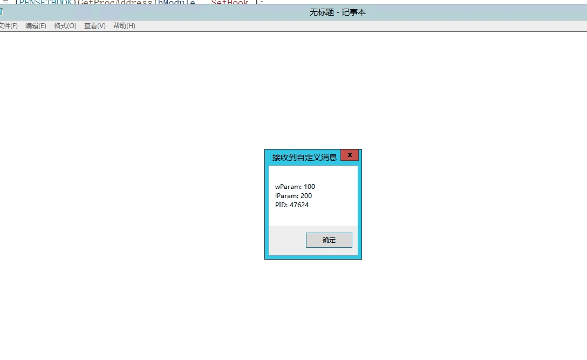

# SetWindowsHookEx注入
##原理
一个正常的消息发送如下：
客户端代码：
```
HWND hwnd = ::FindWindow(NULL,TEXT("接收端窗口名"));						
if(hwnd == NULL)						
{						
	MessageBox(0,TEXT("没找到窗口"),TEXT("ERROR"),MB_OK);					
}						
else						
{						
	// 发送消息  					
	//SendMessage(hwnd,WM_USER+0x1,NULL, (LPARAM)100); 					
	PostMessage(hwnd,WM_USER+0x1, NULL, (LPARAM)100);					
}						
						
```
接收端代码： 
```
switch(uMsg)				
{				
case WM_CLOSE:				
	{			
		EndDialog(hDlg,0);		
		break;		
	}			
case WM_USER+0x1:				
	{			
		DWORD x = wParam;		
		DWORD y = lParam;		
				
		MessageBox(0,0,0,0);		
		break;		
	}			
case WM_COMMAND:				
				
	switch (LOWORD (wParam))			
	{			
	case IDC_BUTTON_RECV:			
		{		
				
				
			return TRUE;	
		}		
	}			
	break ;			
}				
```
但是一般不是自己写的程序是没有WM_USER+0x1这个类型的消息，别的程序不认识，所以我们需要自定义消息来实现。windows允许自己定义消息
```
系统消息已经占用了1023
//$define WM_USER 0x400
如果我们需要定义自己的消息一般WM_USER+0x1 这种消息系统一定不会用
```
但是不是自己写的程序一定没有WM_USER+0x1 ，所以我们需要注入代码，这个注入就是消息HOOK 利用SetWindowsHookEx函数进行挂钩。

## SetWindowsHookEx
```
HHOOK WINAPI SetWindowsHookEx（
  _In_  int    idHook，　　　　　　　　　　　　设置钩子的类型.意思就是我要设置的钩子是什么钩子. 可以是监视窗口过程.可以是监视消息队列.
  _In_ HOOKPROC lpfn，　　　　　　　　　　　　 根据钩子类型.设置不同的回调函数.
  _In_ HINSTANCE hMod，　　　　　　　　　　　　钩子设置的Dll实例句柄,就是DLL的句柄
  _In_ DWORD dwThreadId　　　　　　　　　　   设置钩子的线程ID. 如果为0 则设置为全局钩子.
）;
　　　　　　　　　　　　　　　　　　　　　　　　　 HHOOK 返回值. 是一个钩子过程句柄.

```
先生成一个dll,定义3个函数，分别用于安装钩子，卸载钩子和自定义消息处理函数。其中前两个函数是导出函数，由消息发送程序调用。
```
// dllmain.cpp : 定义 DLL 应用程序的入口点。
#define _CRT_SECURE_NO_WARNINGS
#include "framework.h"
#include <stdio.h>

HHOOK g_HookProc;
extern "C" void __declspec(dllexport) SetHook(); // 安装HOOK
extern "C" void __declspec(dllexport) UnHook(); // 卸载HOOK
LRESULT CALLBACK MessageHookProc(int nCode, WPARAM wParam, LPARAM lParam); //消息处理函数

BOOL APIENTRY DllMain( HMODULE hModule,
                       DWORD  ul_reason_for_call,
                       LPVOID lpReserved
                     )
{
    switch (ul_reason_for_call)
    {
    case DLL_PROCESS_ATTACH:
    case DLL_THREAD_ATTACH:
    case DLL_THREAD_DETACH:
    case DLL_PROCESS_DETACH:
        break;
    }
    return TRUE;
}

extern "C" void __declspec(dllexport) SetHook()
{
	g_HookProc = SetWindowsHookEx(WH_CALLWNDPROC, MessageHookProc, GetModuleHandle(TEXT("MessageHook.dll")), 0);
}

extern "C" void __declspec(dllexport) UnHook()
{
	if (NULL != g_HookProc)
		UnhookWindowsHookEx(g_HookProc);
}

LRESULT CALLBACK MessageHookProc(int nCode, WPARAM wParam, LPARAM lParam)  //我们自己的程序处理             
{
	if (nCode == HC_ACTION)
	{
		PCWPSTRUCT pcw = (PCWPSTRUCT)lParam;
		if (pcw->message == WM_USER + 0x1)
		{
			char szBuf[200] = { 0 };
			sprintf(szBuf, "wParam: %d\nlParam: %d\nPID: %d\n", pcw->wParam, pcw->lParam,GetCurrentProcessId());
			MessageBoxA(0, szBuf, "接收到自定义消息", 0);
		}
	}
	return CallNextHookEx(g_HookProc, nCode, wParam, lParam); //继续调用钩子过程
}

```
然后建立控制台项目：

```
// hooktest.cpp : 此文件包含 "main" 函数。程序执行将在此处开始并结束。
//

#include <iostream>
#include <Windows.h>
#include <stdio.h>

BOOL Inject()
{
	// 安装HOOK
	HMODULE hModule = LoadLibrary(TEXT("messagehook.dll"));
	if (hModule == NULL)
	{
		printf("LoadLibrary失败\n");
		return FALSE;
	}
	typedef void(*PFNSETHOOK)();
	PFNSETHOOK pFnSetHook = (PFNSETHOOK)GetProcAddress(hModule, "SetHook");
	if (NULL == pFnSetHook)
	{
		printf("获取函数地址失败\n");
		return FALSE;
	}
	pFnSetHook();
	// 发送自定义消息
	HWND hWnd = FindWindow(NULL, TEXT("无标题 - 记事本"));
	if (!hWnd)
	{
		printf("获取窗口句柄失败\n");
		return FALSE;
	}
	SendMessage(hWnd, WM_USER + 0x1, (DWORD)100, (DWORD)200);

	//直接卸载
	typedef void(*PFNUNHOOK)();
	PFNUNHOOK pFnUnHook = (PFNUNHOOK)GetProcAddress(hModule, "UnHook");
	pFnSetHook();
	return TRUE;
}

int main()
{
	Inject();
	return 0;
}

```


